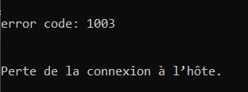
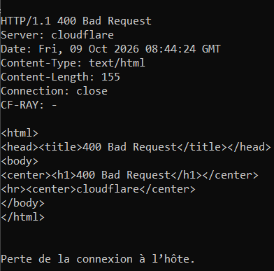
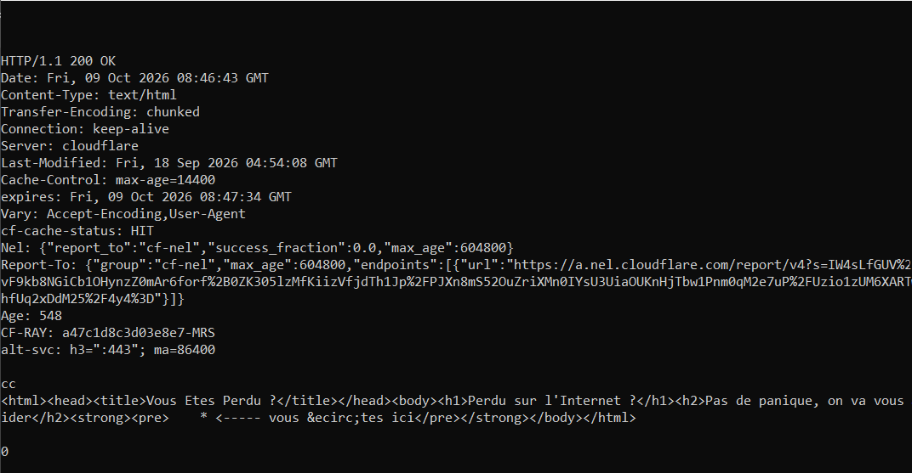

# Compte-Rendu : TP n°3 - HTTP
**ARSIR - Polytech Lyon (4A)**  
**Enseignants :** M. MORGE & N. SALAZAR  
**Année :** 2026–2027  
**Groupe :** 12 - VOICU David et ZANNOUH Amel
---

## Exercice 1 : Naviguez

### Q1. Quels sont les messages associés aux codes 200, 404, 418 et 502?

```
200 OK : requête réussi 
304 Not Modified
404 Not Found : la ressource demandée n'existe pas ou n'a pas était trouvé
418 I'm a teapot : blague de poisson d'avril
502 Bad Gateway : erreur côté serveur 
```
---

## Exercice 2 : Susurrez à l'oreille du serveur

### Q1. Envoi des requêtes avec Telnet vers `perdu.com 80`


#### 1. Requête : `GET /\r\n`


Réponse : error code: 1003
Explication : Aucun nom de site n'est donné, Cloudflare considère la requête comme un accès direct à son IP et la refuse.

#### 2. Requête : `GET / HTTP/1.1\r\n\r\n`


Réponse : 400 Bad Request
Explication : Le champ d'en-tête "Host:" est obligatoire. Son absence entraîne une erreur 400.

#### 3. Requête : `GET / HTTP/1.1\r\nHost:perdu.com\r\n\r\n`


 Réponse : 200 OK (avec les en-têtes de réponse et le contenu HTML de la page.)
 Explication : Requête HTTP/1.1 complète et bien formée.

à quoi sert le champ `Host:` ?
Le champ Host: permet d'identifier le nom de domaine du site demandé,
lorsque plusieurs sites partagent la même adresse IP. Il est obligatoire en HTTP/1.1.


---

## Exercice 3 : Architecture du serveur HTTP

### Q1. Arborescence de fichiers statiques
Nous avons mis en place une arborescence complète avec des pages HTML reliées entre elles :
```
tp3/
├── site1/
│   ├── index.html            (Accueil du site 1)
│   ├── page1.html            (Page secondaire avec lien retour)
│   └── dossier/
│       ├── index.html        (Index du sous-dossier)
│       └── page2.html        (Page dans le sous-dossier avec liens)
```

fin du readme